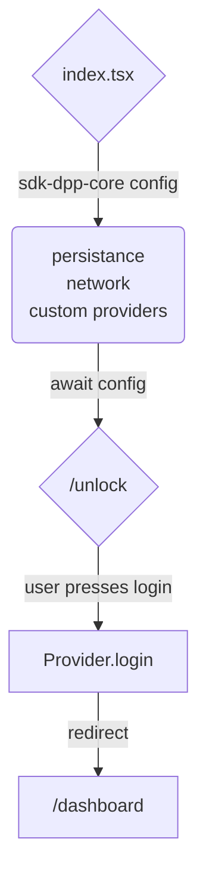

# `core-library`

> TODO: description

## Usage

In your project, make sure to use the `preserveSymlinks` option in the server configuration to ensure that the symlinks are preserved, for ease of development.

``` js
  resolve: {
    preserveSymlinks: true, // 👈
    alias: {
      src: "/src",
    },
  },
```

// TODO: DEMONSTRATE API



