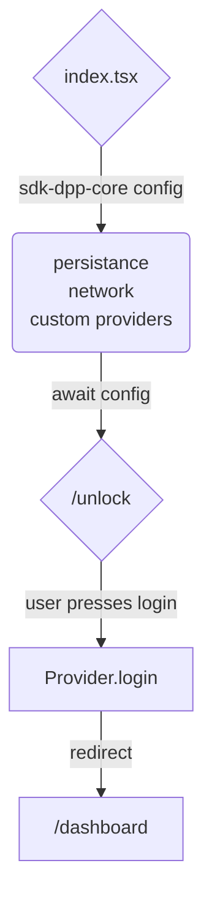

# MultiversX SDK for Front-End DApps

MultiversX Front-End SDK for JavaScript and TypeScript (written in TypeScript).

## Introduction

`sdk-dapp-core` is a library that holds core functional logic that can be used to create a dApp on MultiversX Network.

It is built for applications that use any of the following technologies:
- React
- Angular
- Vue
- Any other JavaScript framework (e.g. Solid.js etc.)
- React Native
- Next.js

## GitHub project
The GitHub repository can be found here: [https://github.com/multiversx/mx-sdk-dapp-core](https://github.com/multiversx/mx-sdk-dapp-core)

## Live demo: template-dapp
See [Dapp template](https://template-dapp.multiversx.com/) for live demo or checkout usage in the [Github repo](https://github.com/multiversx/mx-template-dapp)


## Requirements
- Node.js version 12.16.2+
- Npm version 6.14.4+

## Distribution

[npm](https://www.npmjs.com/package/@multiversx/sdk-dapp)

## Installation

The library can be installed via npm or yarn.

```bash
npm install @multiversx/sdk-dapp-core
```

or

```bash
yarn add @multiversx/sdk-dapp-core
```

If you need only the core logic, without the additional UI, you can create a project-specific `.npmrc` file to configure per-package installation behavior. This will skip the installation of `@multiversx/sdk-dapp-core-ui`, but keep in mind that you may need to provide the UI components yourself.

```bash
## .npmrc
@multiversx/sdk-dapp-core:omit-optional=true
## ebable the option when needed with: 
## @multiversx/sdk-dapp-core:omit-optional=false

##Run Installation When you run npm install, NPM will use the configurations specified in the .npmrc file:
npm install
```

## Debugging your dApp

Use lerna or

In your project, make sure to use the `preserveSymlinks` option in the server configuration to ensure that the symlinks are preserved, for ease of development.

``` js
  resolve: {
    preserveSymlinks: true, // 👈
    alias: {
      src: "/src",
    },
  },
```

// TODO: DEMONSTRATE init app



