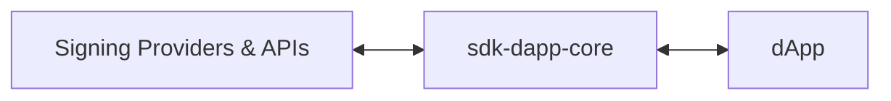
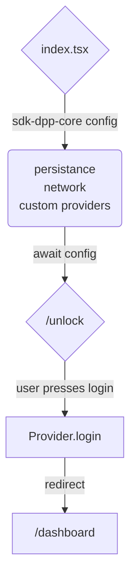

# MultiversX SDK for Front-End DApps

MultiversX Front-End SDK for JavaScript and TypeScript (written in TypeScript).

## Introduction

`sdk-dapp-core` is a library that holds core functional logic that can be used to create a dApp on MultiversX Network.

It is built for applications that use any of the following technologies:
- React
- Angular
- Vue
- Any other JavaScript framework (e.g. Solid.js etc.)
- React Native
- Next.js

## GitHub project
The GitHub repository can be found here: [https://github.com/multiversx/mx-sdk-dapp-core](https://github.com/multiversx/mx-sdk-dapp-core)

## Live demo: template-dapp
See [Dapp template](https://template-dapp.multiversx.com/) for live demo or checkout usage in the [Github repo](https://github.com/multiversx/mx-template-dapp)


## Requirements
- Node.js version 20.13.1+
- Npm version 10.5.2+

## Distribution

[npm](https://www.npmjs.com/package/@multiversx/sdk-dapp)

## Installation

The library can be installed via npm or yarn.

```bash
npm install @multiversx/sdk-dapp-core
```

or

```bash
yarn add @multiversx/sdk-dapp-core
```

If you need only the core logic, without the additional UI, you can create a project-specific `.npmrc` file to configure per-package installation behavior. This will skip the installation of `@multiversx/sdk-dapp-core-ui`, but keep in mind that you may need to provide the UI components yourself.

```bash
## .npmrc
@multiversx/sdk-dapp-core:omit-optional=true
## ebable the option when needed with: 
## @multiversx/sdk-dapp-core:omit-optional=false

##Run Installation When you run npm install, NPM will use the configurations specified in the .npmrc file:
npm install
```

If you're transitioning from @multiversx/sdk-dapp, you can check out the [Migration guide PR](https://github.com/multiversx/mx-template-dapp/pull/264) of Template Dapp

## Usage

sdk-dapp-core aims to abstract and simplify the process of interacting with users' wallets and with the MultiversX blockchain, allowing developers to easily get started with new applications.



The basic concepts you need to understand are configuration, provider interaction, transactions, and presenting data. These are the building blocks of any dApp, and they are abstracted in the `sdk-dapp-core` library.

**Table 1**. Elements needed to build a dApp
| # | Type | Description |
|---|------|-------------|
| 1 | Network | Chain configuration |
| 2 | Provider | The signing provider for logging in and singing transactions |
| 3 | Account | Inspecting user address and balance |
| 4 | Transactions Manager | Sending and tracking transactions |
| 5 | Components | Displaying UI information like balance, public keys etc. |

Since these are a mixtures of business logic and UI components, the library is split into several folders to make it easier to navigate.
When inspectig the package, there is more content under `src`, but the main folders of intereset are:

```bash
src/
├── apiCalls/ ### methods for interacting with the API
├── constants/ ### useful constants from the ecosystem like ledger error codes, default gas limits for transactions etc.
├── controllers/ ### business logic for UI elements like transactions and amount formatting
├── core/ ### hosting provider the class, and all implementations for different signing providers
└── store/ ### sore initialization, middleware, slices, selectors and actions
```

Conceptually, these can be plit into 3 main parts: 
- First is the business logic in `apiCalls`, `constants` and `core` (signing providers). 
- Then comes the persistence layer hosted in the `store` folder, using [Zustand](https://zustand.docs.pmnd.rs/) under the hood.
- Last are the UI components hosted in [@multiversx/sdk-dapp-core](https://github.com/multiversx/mx-sdk-dapp-core-ui) with some components controlled on demand by classes defined in `controlles`

Having this knowledge, we can considers several steps needed to dApp together:

**Table 2**. Steps to build a dApp
| # | Step | Description |
|---|------|-------------|
| 1 | Configuration | -  storage configuration (e.g. sessionStorage, localStorage etc.)<br>-  chain configuration<br>-  custom provider configuration (adding / disabling / changing providers) |
| 2 | Provider interaction | -  logging in and out<br>-  siging transactions / messages |
| 3 | Transactions | -  sending transactions<br>-  tracking transactions |
| 4 | Presenting data | -  get store data (e.g. account balance, account address etc.)<br>-  use components to display data (e.g. balance, address, transactions list) |

Each of these steps will be explained in more detail in the following sections.

### 1. Configuring your dApp

Before your application bootstraps, you need to configure the storage, the network, and the signing providers. This is done by calling the `initApp` method from the `core/methods` folder.

```typescript
// index.tsx
import { initApp } from '@multiversx/sdk-dapp-core/out/core/methods/initApp/initApp';
import type { InitAppType } from '@multiversx/sdk-dapp-core/out/core/methods/initApp/initApp.types';
import { EnvironmentsEnum } from '@multiversx/sdk-dapp-core/out/types/enums.types';
import { App } from "./App";

const config: InitAppType = {
  storage: { getStorageCallback: () => sessionStorage },
  dAppConfig: {
    // nativeAuth: true, // optional
    environment: EnvironmentsEnum.devnet,
    // network: { // optional
    //   walletAddress: 'https://devnet-wallet.multiversx.com'
    // },
    successfulToastLifetime: 5000
  }
  // customProviders: [myCustomProvider] // optional
};

initApp(config).then(() => {
  render(() => <App />, root!); // render your app
});
```


Teo be able to accomplish the steps lined out in Table 1, you will need to have basic knowledge about the following elements:


## Debugging your dApp

Use lerna or

In your project, make sure to use the `preserveSymlinks` option in the server configuration to ensure that the symlinks are preserved, for ease of development.

``` js
  resolve: {
    preserveSymlinks: true, // 👈
    alias: {
      src: "/src",
    },
  },
```

// TODO: DEMONSTRATE init app



